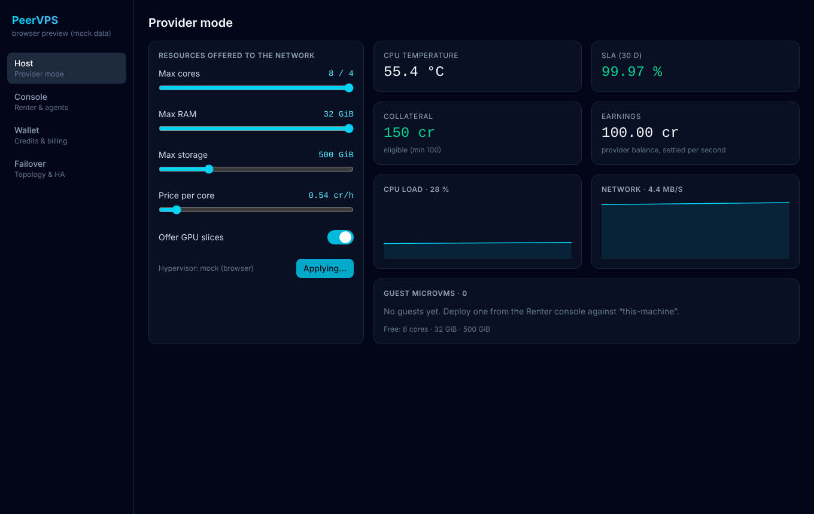
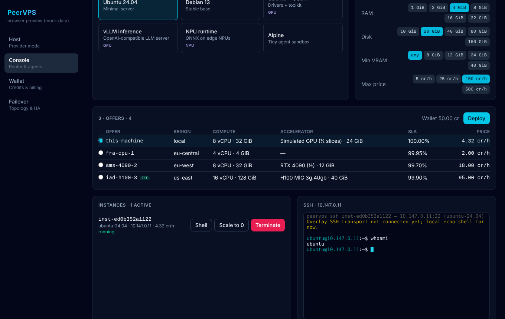
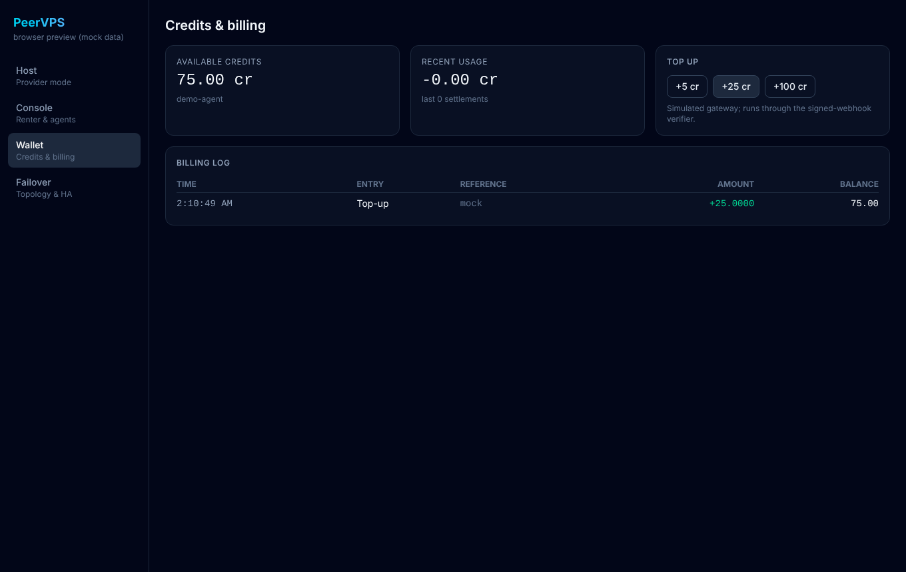
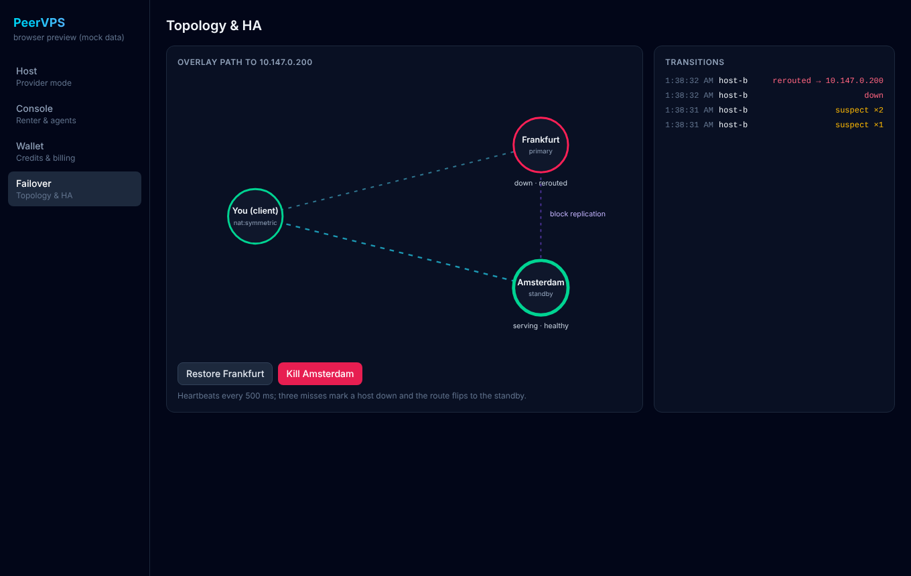

# PeerVPS

Decentralized, agent-native compute network: anyone can rent out spare CPU/GPU/NPU capacity as
hardware-isolated MicroVMs, and humans or autonomous AI agents can find, deploy, scale and pay for them
programmatically. A ZeroTier-style encrypted P2P overlay connects clients straight to their guests.

This repository is the monorepo scaffold: a Rust node engine, a CLI/headless node for agents, and a
Tauri v2 desktop dashboard (React 19 + TypeScript + Tailwind CSS 4).

```
peer-vps/
├── Cargo.toml                    Rust workspace (lints: unsafe denied, clippy::all)
├── crates/
│   ├── peervps-core/             Node engine (library)
│   │   └── src/
│   │       ├── virtualization/   MicroVM provisioner, KVM backend, vGPU/NPU slices, TEE, proof of compute
│   │       ├── network/          zstd + ChaCha20-Poly1305 tunnel codec, Noise IK, STUN, hole punching, TUN, routing
│   │       ├── failover/         heartbeats, (A) hibernation, (B) block replication, (C) SLA slashing, Kademlia table
│   │       ├── storage/          SQLite (WAL) + versioned migrations, presence log
│   │       ├── billing/          µcredit ledger, per-second meter, collateral + pools, signed payment webhooks
│   │       ├── api/              REST /v1 for agents (axum) + marketplace filter
│   │       └── node.rs           façade wiring everything together
│   └── peervps-cli/              `peervps` CLI + `peervps serve` headless node
├── proto/peervps/v1/node.proto   gRPC contract mirroring the REST API
└── apps/desktop/                 Tauri v2 app
    ├── src/                      React UI: Host, Console (+ xterm), Wallet, Failover topology
    │   └── bridge/               typed `invoke` wrappers + 60 fps event store
    └── src-tauri/                commands, event pump, metrics sampler, failover demo topology
```

## The desktop app

The UI lives in [`apps/desktop`](apps/desktop): `pnpm tauri dev` opens it as a native app, `pnpm dev`
opens the same UI in a browser at http://localhost:1420 against mock data. Screens from the QA run:

| Host (provider mode) | Console (renter + SSH) |
|---|---|
|  |  |
| **Wallet** | **Failover** |
|  |  |

## Platforms

| | Linux | macOS (12+, Apple silicon and Intel) | Windows (10/11, x64) |
|---|---|---|---|
| Desktop app, CLI, renter side, wallet, overlay codec | ✓ | ✓ | ✓ |
| Host telemetry (CPU, RAM, network, temperature) | ✓ | ✓ | ✓ |
| **Local VMs** (QEMU backend) | ✓ KVM | ✓ Hypervisor.framework | ✓ Windows Hypervisor Platform |
| Firecracker MicroVMs | ✓ (`/dev/kvm`) | — | — |
| Overlay TUN device | `/dev/net/tun` | `utun<N>` (needs root) | not yet (Wintun) |

CI builds and tests every commit on all three and attaches an unsigned `PeerVPS.dmg` (macOS) and
`PeerVPS_x64-setup.exe` (Windows) to each run. Because they are unsigned, open the Mac app the first time
with right-click → Open, and on Windows choose "More info → Run anyway" in SmartScreen.

## Releases

Installers and CLI binaries for all three systems are on the
[Releases page](https://github.com/evrenbetimen/peer-vps/releases): `.AppImage`/`.deb` (Linux x64),
a universal `.dmg` (macOS), `*-setup.exe` (Windows x64), the `peervps` CLI as an archive per system, and
`SHA256SUMS`. To cut one, bump the version in `Cargo.toml`, `apps/desktop/package.json` and
`apps/desktop/src-tauri/tauri.conf.json`, then push a `vX.Y.Z` tag or run the **Release** workflow
from the Actions tab with that tag.

## Local VMs (Linux, macOS, Windows)

The QEMU backend runs real virtual machines on the machine PeerVPS runs on, with the OS's own
hypervisor: KVM on Linux, Hypervisor.framework on macOS, the Windows Hypervisor Platform on Windows
(falls back to software emulation when none is available). Guests boot stock cloud images from a
copy-on-write overlay, get a login user, password and your SSH keys through cloud-init, and are
reachable with `ssh -p <port> peervps@127.0.0.1`. No root, bridge or tap device is needed.

1. Install QEMU: `brew install qemu` · `sudo apt install qemu-system qemu-utils` ·
   `winget install SoftwareFreedomConservancy.QEMU` (Windows also needs the "Windows Hypervisor Platform"
   feature turned on in *Turn Windows features on or off*).
2. **Desktop app:** PeerVPS finds QEMU by itself. Download an image under Host → Guest images, then
   deploy from Console against "this-machine". The instance shows its SSH command and password, and the
   terminal shows the guest's live serial console.
3. **Headless / agents:**

```bash
peervps image pull ubuntu-24.04                  # also ubuntu-22.04, debian-13; checksum-verified
peervps serve --hypervisor qemu --ssh-key ~/.ssh/id_ed25519.pub
peervps deploy fra-cpu-1 --vcpus 2 --mem-mib 2048 --disk-gib 20 --image ubuntu-24.04
peervps access <instance-id>                     # {"command": "ssh -p 40123 peervps@127.0.0.1", "access": {...}}
```

Images live in `~/.local/share/peervps/images`, `~/Library/Application Support/PeerVPS/images` or
`%LOCALAPPDATA%\PeerVPS\images`. Any qcow2 disk there can be deployed by its file name. macOS guests are not
offered: Apple's license only allows them on Apple hardware through Virtualization.framework, which is a
separate backend.

### Installing from an ISO (Windows too)

Add an installer ISO with **Host → Guest images → Add ISO or disk…** or `peervps image import <file.iso>`,
then deploy it like any other image. The guest boots the installer with a blank disk, and its screen is on a
password-protected loopback VNC port: **Open screen** on the instance (or `open vnc://…` from `peervps access`).

Windows ISOs are recognized by their volume label and get what Windows needs without extra drivers: an NVMe
disk, an e1000e network card on x86, UEFI on x86 when OVMF is installed, and an answer file on a small USB
stick that skips Windows 11's TPM / Secure Boot / RAM checks, creates the `peervps` administrator with the
password the instance shows, and turns on Remote Desktop (forwarded to a loopback port; Windows Pro and up).
You still pick the language, edition and disk on the installer screen. Requirements and caveats:

- Use the ISO for your machine's CPU: on Apple silicon the **Windows 11 ARM64** ISO
  (microsoft.com/software-download/windows11arm64). The other architecture is refused, since it would only
  run emulated.
- At least 4 GiB RAM and a 32 GiB disk (80 GiB is a comfortable default); the disk file grows as Windows fills it.
- Windows on Arm has no in-box driver for the virtio network card: put `virtio-win.iso`
  (from the Fedora virtio-win project) in the image directory as `virtio-win.iso`; it is attached to Windows
  guests and its network driver is installed on first sign-in.
- Scale to zero is not available for ISO-installed guests yet; pause or terminate them instead.

## Renting between machines (peers)

Two PeerVPS machines can rent VMs from each other directly. Each node has its own key (`node.key` in the data
directory) and a peer id derived from it, like `pv-471a2ac53bb0f16c`. Nodes talk over TCP port 7071 with a
Noise `XX` handshake (X25519, ChaChaPoly, BLAKE2s), so every connection is encrypted and both machines prove
their key.

1. On the machine that will host, open **Host → Peers** and copy its invite (`pv-…@192.168.1.20:7071`), or
   run `peervps serve --peer-listen 0.0.0.0:7071` and read the invite it prints.
2. On the other machine, paste the invite into **Add peer** (or `peervps peer add <invite>`). The key is
   pinned; if a different machine answers on that address later, it is refused.
3. The host sees the newcomer under **wants to rent from you** and clicks **Approve** (`peervps peer approve
   <id>`). Approving also connects back, so from then on both can rent from each other.
4. The host's own offer shows up in the other machine's **Console** as `<peer id>/this-machine`. Deploy,
   scale to zero, terminate, the console, SSH, Remote Desktop and the installer screen all work as for a
   local VM: the VM runs on the host, and its ports are carried through the encrypted connection to ports on
   the renter's `127.0.0.1`. Nothing on the host is exposed beyond its own loopback.

Machines on the same network find each other: each one announces itself on UDP port 7072, and the others
list it under **On this network** with an **Add** button (`nearby` in `peervps peer list`). The announcement
only saves typing; adding still checks the key the machine proves.

To be added from **another network**, turn on **Reachable from other networks** (`peervps peer internet on`,
or `serve --upnp`). PeerVPS asks the router over UPnP to forward a TCP port to this machine, checks with a
public STUN server what address the internet sees, and shows a second invite with that address. It tells you
plainly when this cannot work:

- the router does not answer UPnP: turn UPnP on in the router, or forward TCP 7071 to this machine by hand;
- the router's own internet address is private or `100.64.x.x`, or differs from what STUN sees: the provider
  (or a second modem) shares one address between customers (CGNAT), and nothing on your side can open a port.
  The other machine can still add you if it is reachable, since either side can host. A relay for two
  machines that are both behind CGNAT is not built yet.

The image must be installed on the host (pull or import it there). Money does not cross machines yet: the
host gives each new peer a one-time 50-credit welcome balance and bills it per second in its own ledger.
The REST API mirrors all of it: `GET/POST /v1/peers`, `POST /v1/peers/{id}/approve`,
`DELETE /v1/peers/{id}`, `PUT /v1/peers/internet`.

## What is real and what is a stub

| Area | Working today | Stubbed behind a trait (next steps) |
|---|---|---|
| Virtualization | Resource allocator with core pinning, RAM/disk budgets, fractional GPU/NPU slice accounting; **QEMU backend runs real VMs on Linux, macOS and Windows** (cloud images, copy-on-write disks, cloud-init login, SSH port forward, pause/resume, snapshot + restore, serial console); **Firecracker backend boots real MicroVMs** (per-VM disk, pinned cores, optional bridged tap NIC, pause/resume, full snapshot + restore, serial console); raw KVM backend creates VM, RAM and vCPUs | Firecracker `jailer` hardening, reflink/overlay disks, GPU passthrough (needs a QEMU/cloud-hypervisor backend), SEV-SNP/TDX launch and real attestation |
| Proof of compute | Nonce-bound sequential BLAKE3 hash-chain with spot-check verification and tier timing | Succinct ZK proof (zkVM receipt) behind the same `ComputeProver`/`ComputeVerifier` traits |
| Network | Tunnel codec (zstd → ChaCha20-Poly1305, replay window), Noise IK handshake (`snow`), STUN client/responder, UDP hole punching with port spraying, overlay routing table, Linux TUN pump; **node-to-node renting over Noise XX TCP** (pinned keys, approval, remote deploy and port carrying), LAN discovery beacons, UPnP IGD port forwarding with STUN and CGNAT detection | TURN relay fallback, DHT RPCs on the wire, QUIC snapshot transport, a relay for peers that are both behind CGNAT, cross-node settlement |
| Failover | Authenticated heartbeats, 3-miss detection, route flip to standby, snapshot seal/open (zstd + chunked AEAD), SIGTERM/SIGINT hibernation, dirty-block replication, SLA slashing | logind shutdown inhibitor, replica restore path |
| Billing | Integer µcredit ledger with journal, per-second settlement (drift-free), platform fee, suspension on empty balance, collateral lock/unlock/slash, pooled staking with pro-rata slashing, HMAC-SHA256 webhooks with replay window and idempotency | Real payment provider integration (an `HttpGateway` skeleton exists) |
| API | REST `/v1` (offers, deploy, scale to zero, terminate, account, webhooks), CLI | tonic server for the `.proto` contract, event streaming |
| Desktop | All four views wired to the node through `invoke` and a frame-throttled event stream; the failover view drives the real `FailoverController` | SSH over the overlay (the terminal is a local echo shell for now) |

## Prerequisites

* Rust 1.90+ (edition 2024)
* QEMU, only for real local VMs (see "Local VMs")
* Node 22 + pnpm 10
* Linux desktop builds: `libwebkit2gtk-4.1-dev libgtk-3-dev libayatana-appindicator3-dev librsvg2-dev libssl-dev`
* macOS: Xcode Command Line Tools (`xcode-select --install`)
* Windows: Visual Studio Build Tools with "Desktop development with C++" and WebView2 (preinstalled on Windows 11);
  see the [Tauri prerequisites](https://v2.tauri.app/start/prerequisites/)

## Build, lint, test

```bash
pnpm install
pnpm build                                   # typecheck + bundle the UI (the Tauri crate embeds apps/desktop/dist)
cargo fmt --all --check
cargo clippy --workspace --all-targets -- -D warnings
cargo test --workspace
pnpm test                                    # UI unit tests (Vitest)
pnpm test:e2e                                # UI end-to-end QA (Playwright)
```

The full QA/QC plan, what each suite covers and the gates CI enforces are in [docs/QA.md](docs/QA.md).

## Run

```bash
pnpm tauri dev                               # desktop app (Host / Console / Wallet / Failover)
pnpm tauri build --bundles dmg               # macOS: PeerVPS.dmg in target/release/bundle/dmg
pnpm dev                                     # UI only, in a browser, against mock data

cargo run -p peervps-cli -- serve            # headless node on 127.0.0.1:7070 (prints a demo API key)
export PEERVPS_API_KEY=pvps_demo_key
cargo run -p peervps-cli -- offers --min-vram-mib 10000 --max-price-per-hour 50
cargo run -p peervps-cli -- deploy fra-cpu-1 --vcpus 2 --mem-mib 4096
cargo run -p peervps-cli -- scale <instance-id> 0
cargo run -p peervps-cli -- account
cargo run -p peervps-cli -- console <instance-id>   # guest serial console (Firecracker backend)
```

### Booting real MicroVMs (Linux with `/dev/kvm`)

```bash
scripts/fetch-firecracker-assets.sh .firecracker    # firecracker binary, guest kernel, Ubuntu 24.04 rootfs + SSH key
sudo cargo run -p peervps-cli -- serve --hypervisor firecracker \
  --fc-binary .firecracker/firecracker --fc-kernel .firecracker/vmlinux --fc-images .firecracker/images \
  [--bridge br0]                                     # give guests a NIC on an existing bridge
```

Every VM gets `<data dir>/vms/<vm>/` (or `--run-dir`) with its API socket, root disk, snapshot files and `console.log`.
Without `--bridge` guests boot with no network. Guests asking for a GPU/NPU are refused by this backend.

## Safety rules

* `unsafe_code = "deny"` across the workspace. The only exception is `virtualization/kvm.rs`, which opts in
  explicitly and documents each block with a `// SAFETY:` comment (`clippy::undocumented_unsafe_blocks` is denied).
* Money is integer µcredits everywhere; every balance change is a journaled row inside one SQLite transaction,
  and balances have a `CHECK (balance >= 0)` constraint.
* Every network-facing message is authenticated: tunnel datagrams (AEAD), heartbeats (keyed BLAKE3),
  snapshots (per-chunk AEAD bound to VM id, index and count), webhooks (HMAC-SHA256 + timestamp).
